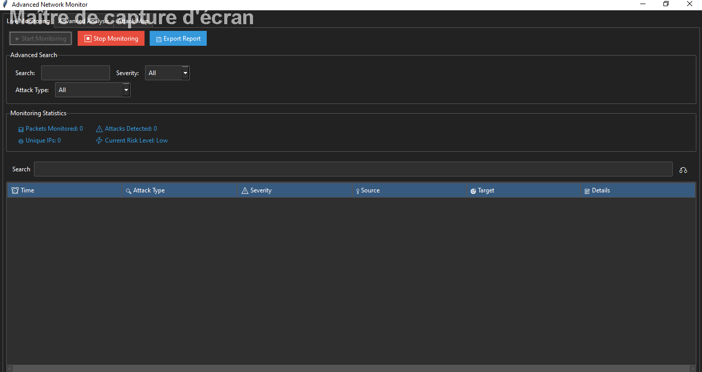
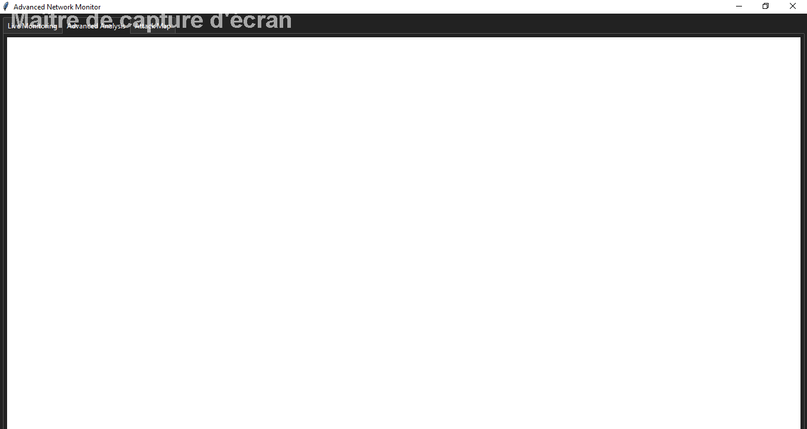
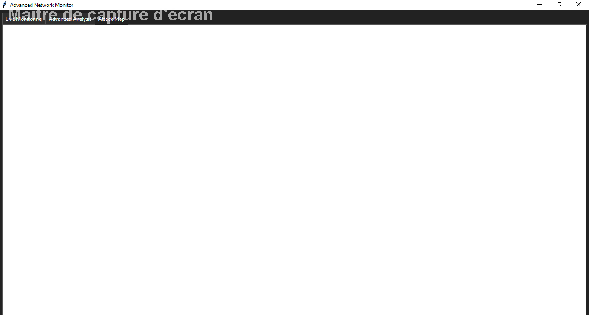
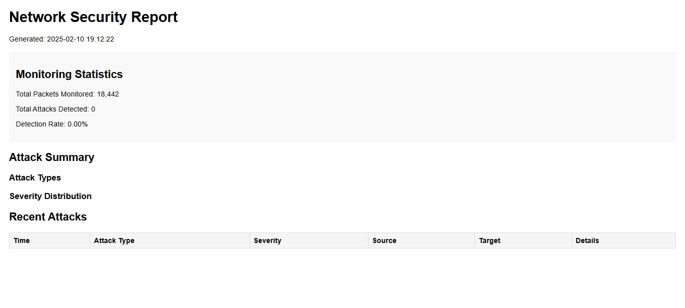

# Advanced Network Monitor | Moniteur de Réseau Avancé | مراقب الشبكة المتقدم

## Table of Contents | Table des matières | جدول المحتويات
- [Introduction](#introduction) | [Introduction](#introduction) | [المقدمة](#introduction)
- [Features](#features) | [Fonctionnalités](#features) | [الميزات](#features)
- [Installation](#installation) | [Installation](#installation) | [التثبيت](#installation)
- [Usage](#usage) | [Utilisation](#usage) | [طريقة الاستخدام](#usage)
- [Screenshots](#screenshots) | [Captures d'écran](#screenshots) | [لقطات الشاشة](#screenshots)
- [Contributing](#contributing) | [Contribution](#contributing) | [المساهمة](#contributing)


## Introduction | Introduction | المقدمة
The **Advanced Network Monitor** is a comprehensive network monitoring tool designed to detect and analyze various types of network attacks in real-time. Built using **Python** and **Tkinter** for the GUI, this application leverages **Scapy** for packet capture and analysis, and integrates with various libraries for **data visualization, geolocation, and threat analysis**.

Le **Moniteur de Réseau Avancé** est un outil de surveillance réseau complet conçu pour détecter et analyser en temps réel divers types d'attaques réseau. Développé en **Python** avec une interface graphique en **Tkinter**, il utilise **Scapy** pour la capture et l'analyse des paquets et s'intègre à diverses bibliothèques pour la **visualisation des données, la géolocalisation et l'analyse des menaces**.

**مراقب الشبكة المتقدم** هو أداة شاملة لمراقبة الشبكة مصممة لاكتشاف وتحليل أنواع مختلفة من الهجمات الشبكية في الوقت الفعلي. تم تطويره باستخدام **بايثون** و**Tkinter** لواجهة المستخدم، ويعتمد على **Scapy** لالتقاط الحزم وتحليلها، مع تكامل العديد من المكتبات لتحليل البيانات، وتحديد المواقع الجغرافية، وتحليل التهديدات.

## Features | Fonctionnalités | الميزات
- **Real-time Packet Capture**: Monitors network traffic in real-time using Scapy.
- **Attack Detection**: Detects various types of network attacks such as **SYN Flood, Ping Flood, Port Scan, DNS Amplification, and ARP Spoofing**.
- **Threat Level Analysis**: Provides a real-time threat level based on detected attacks.
- **Advanced Search & Filtering**: Allows users to filter detected attacks by severity, type, and search terms.
- **Data Visualization**: Includes interactive graphs showing attack type distribution and attack rate over time.
- **Network Mapping**: Visualizes the network topology of recent attacks.
- **Detailed Reporting**: Exports comprehensive **HTML reports** with attack statistics and details.
- **IP Geolocation**: Provides geolocation information for detected IP addresses.
- **Logging**: Maintains detailed logs of all detected attacks and system events.

## Installation | Installation | التثبيت
### Prerequisites | Prérequis | المتطلبات الأساسية
- **Python 3.7 or higher**
- **Pip (Python package manager)**

### Steps | Étapes | الخطوات
1. Clone the Repository:
   ```bash
   git clone https://github.com/idbaha-lahoucine96/Advanced-Network-Monitor.git
   cd advanced-network-monitor
   ```
2. Install Required Packages:
   ```bash
   pip install -r requirements.txt
   ```
3. Run the Application:
   ```bash
   python main.py
   ```

## Usage | Utilisation | طريقة الاستخدام
- **Start Monitoring**: Click the "Start Monitoring" button to begin capturing network packets.
- **View Detected Attacks**: Detected attacks will appear in the main table with details such as time, attack type, severity, source, and target.
- **Filter Attacks**: Use the advanced search and filtering options to narrow down the list of detected attacks.
- **View Graphs**: Navigate to the "Advanced Analysis" tab to view graphs showing attack type distribution and attack rate over time.
- **Network Map**: Check the "Attack Map" tab to visualize the network topology of recent attacks.
- **Export Report**: Click the "Export Report" button to generate and save a detailed **HTML report** of the detected attacks.

## Screenshots | Captures d'écran | لقطات الشاشة
### Main Monitoring Page | Page principale de surveillance | الصفحة الرئيسية للمراقبة


### Advanced Analysis Page | Page d'analyse avancée | صفحة التحليل المتقدم


### Attack Map Page | Carte des attaques | خريطة الهجمات


### Exported Report | Rapport exporté | التقرير المُصدَّر


## Contributing | Contribution | المساهمة
Contributions are welcome! If you would like to contribute to the project, please follow these steps:
1. Fork the repository.
2. Create a new branch (`feature-branch`).
3. Make your changes and commit them.
4. Push to your fork and create a pull request.

Les contributions sont les bienvenues ! Si vous souhaitez contribuer au projet, veuillez suivre ces étapes :
1. Forkez le dépôt.
2. Créez une nouvelle branche (`feature-branch`).
3. Apportez vos modifications et validez-les.
4. Poussez vers votre fork et créez une pull request.

المساهمات مرحب بها! إذا كنت ترغب في المساهمة في المشروع، يُرجى اتباع الخطوات التالية:
1. قم بعمل Fork للمستودع.
2. أنشئ فرعًا جديدًا (`feature-branch`).
3. قم بإجراء التعديلات وقم بحفظها.
4. ادفع التعديلات إلى الـ Fork الخاص بك وأنشئ طلب سحب.


